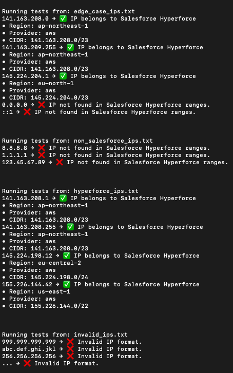
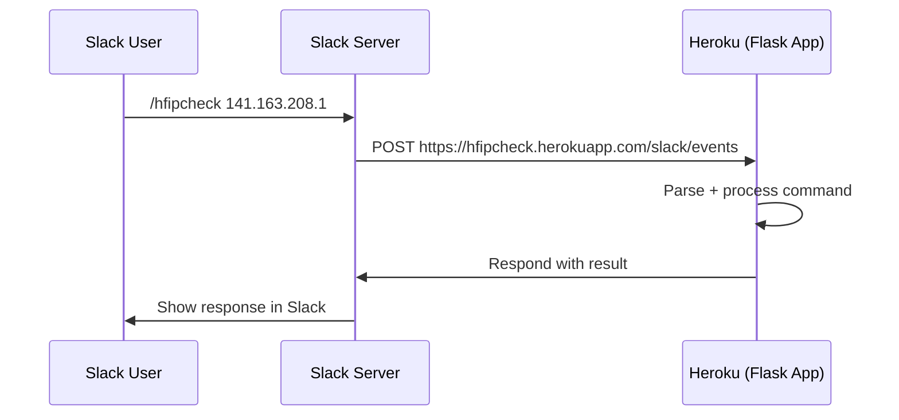

# ⚡ HFIPcheck – Hyperforce IP Check Slack Bot

**HFIPcheck** is a lightweight Slack bot built to help support engineers quickly verify whether an IP address belongs to Salesforce’s Hyperforce infrastructure.

Developed with Flask and Slack’s Bolt SDK, this tool enables fast IP checks directly in Slack using the `/hypercheck` command — reducing manual triage effort and empowering teammates with limited networking experience.

---

## 🚀 Features

- ✅ Validates IPs against Salesforce's official [IP ranges](https://ip-ranges.salesforce.com/ip-ranges.json)
- 🔍 Supports CIDR range matching (e.g., 141.163.208.2 matches 141.163.208.0/23)
- 🌐 Runs as a Heroku-hosted Flask app with Slack command integration
- 🧪 Includes test harness and IP sample files
- 🔒 Environment variables manage secrets securely

---

## 📦 Project Structure

```
hfipcheck/
├── app.py               # Flask entry point
├── slack_handler.py     # Slack command logic
├── hypercheck.py        # Core IP validation logic
├── fetch_ip_data.py     # Fetches IP ranges from Salesforce
├── ip_data.json         # Cached Salesforce IP list
├── requirements.txt     # Dependencies
├── .env                 # Slack secrets (excluded from Git)
└── test_ips/            # Sample IP files + test runner
```


---

## 🌐 Deployment

The app is deployed to **Heroku**, and is automatically accessible from your configured Slack workspace. No need to run it manually on your local machine.

### 📬 Slack Request URL
In your Slack app settings, the request URL should be:
Replace `<your-app-name>` with your actual Heroku app name (e.g., `hfipcheck`).

---

## 🤖 Slack Usage Example

Once connected, users in Slack can simply type:

```
/hypercheck 141.163.208.1
```

Bot response:

```
✅ IP belongs to Salesforce Hyperforce
• Region: ap-northeast-1
• Provider: aws
• CIDR: 141.163.208.0/23
```

---

## 🛡️ Security

- Slack tokens and secrets are stored in .env and managed securely in Heroku config vars
- No secrets are committed to Git
- Hosted in a secure Heroku environment

---

## 🛠️ Built With

- Python 3.9+
- Flask
- Slack Bolt SDK
- Heroku
- ipaddress module

---

## 🧑‍💻 Author

**Yusei Yamaguchi**  
Senior Support Engineer – Network Infrastructure  
Aspiring Software Engineer | Focused on tools that bridge ops & automation

---

## 📸 Screenshot



---

## 🧭 Flow Summary




## 📝 License

This project is licensed under the [MIT License](./LICENSE).
